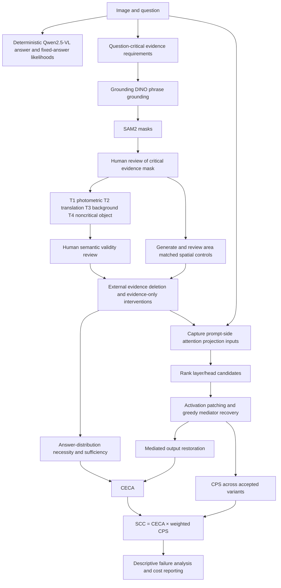

# Semantic Causal Pathway Consistency in MLLMs

This repository implements the research plan in [Semantic_Causal_Pathway_Consistency_MLLM_Architecture.md](Semantic_Causal_Pathway_Consistency_MLLM_Architecture.md). The study asks whether meaning-preserving visual variants preserve an MLLM's evidence-to-circuit pathway, and whether pathway consistency predicts unsupported answers or robustness failures.

## End-to-end system



The executable research path is in `scripts/run_pilot.py`; reusable code is in `src/semantic_circuits/`. The notebook is an exploratory walkthrough. The earlier `egcr_vqa` prototype remains an independent evidence-abstention baseline and is not part of this pipeline.

## Setup on the experiment PC

Use a 64-bit Windows 10/11 PC or a recent Linux PC, Python 3.11, and an NVIDIA GPU for the 7B causal tracing run. Reserve about 50 GB of free disk for model snapshots, the Python environment, images, masks, and variants. A GPU with 24 GB VRAM is a practical target for Qwen2.5-VL-7B plus repeated activation tracing; less memory may require a smaller model or lower-resolution inputs and will be a different model condition. CPU can prepare files and run lightweight checks, but repeated 7B tracing is impractical. The config caps image input at 1,003,520 pixels by default; the [model guide](https://huggingface.co/Qwen/Qwen2.5-VL-7B-Instruct) describes changing image pixel limits to trade resolution against memory and compute. Keep this repository and all data/checkpoints on a drive with enough free space.

The project uses Python 3.11 and stores downloads under `.venv/hf_home` and pilot data under `.venv/data`. Do not copy a `.venv` from another computer; create it on the target PC.

### Windows PowerShell

1. Install Python 3.11 (include the Python launcher) and an NVIDIA driver compatible with the selected PyTorch CUDA build. Check the GPU is visible with `nvidia-smi`.
2. In the project folder, create the environment:

   ```powershell
   py -3.11 -m venv .venv
   .\.venv\Scripts\python.exe -m pip install --upgrade pip
   ```

3. For an NVIDIA GPU, open the official [PyTorch install selector](https://pytorch.org/get-started/locally/), choose Windows + Pip + Python + the CUDA option supported by the driver, and run its command using `.venv\Scripts\python.exe -m pip` in place of `pip`. This installs the correct CUDA-enabled build into this environment. Skip this step for CPU-only setup.
4. Install the project packages and notebook kernel:

   ```powershell
   powershell -ExecutionPolicy Bypass -File scripts\setup_windows.ps1
   .\.venv\Scripts\python.exe -c "import torch; print('torch', torch.__version__, 'CUDA available:', torch.cuda.is_available())"
   ```

   With CUDA, the last line should report `True`. If it reports `False`, fix the PyTorch/driver setup before downloading the 7B model.

### Linux

Install Python 3.11 and the NVIDIA driver, create `.venv`, install the matching CUDA-enabled PyTorch build from the official selector, then run:

```bash
bash scripts/setup_venv.sh
./.venv/bin/python -c 'import torch; print(torch.__version__, torch.cuda.is_available())'
```

`setup_venv.sh` installs requirements into `.venv`; install the CUDA PyTorch build first so the requirement is already satisfied. On Windows and Linux, use the project interpreter for every command below.

## Pilot workflow

## Cross-dataset Qwen fine-tuning

The causal pathway pilot and model fine-tuning are separate experiments. The fine-tuning path below trains LoRA adapters for Qwen2.5-VL on VQAv2 and GQA. Dataset links, expected archive layouts, conversion commands, and licensing notes are in [data/README.md](data/README.md). This repository does not redistribute dataset images.

Install dependencies as above, download the two official datasets, and follow [data/README.md](data/README.md) to convert them and build combined `train.jsonl`, `validation.jsonl`, and `locked_test.jsonl` manifests. The setup uses both full training splits and holds out 10% of labeled validation images for one final local evaluation. Check the retained row counts and inspect image paths before launching training.

The training script defaults to 15 epochs. For 5-fold cross-validation, create five image-grouped folds and train one separate 15-epoch adapter per fold:

```bash
python scripts/build_vqa_folds.py --input data/processed/train.jsonl --output-dir data/processed/folds --folds 5 --seed 17
for fold in 0 1 2 3 4; do
  python scripts/train_qwen_vl_lora.py --train "data/processed/folds/fold_${fold}/train.jsonl" --validation "data/processed/folds/fold_${fold}/validation.jsonl" --output-dir "outputs/qwen-vqa-lora/fold_${fold}" --epochs 15 --batch-size 1 --grad-accumulation 8
done
```

Evaluate each fold's `best_adapter` on its matching fold validation file; each output reports VQAv2 and GQA separately. Then train the final adapter on all of `train.jsonl`, use `validation.jsonl` for checkpoint selection, and use `locked_test.jsonl` once for final reporting. See [data/README.md](data/README.md) for the complete workflow.

```bash
for fold in 0 1 2 3 4; do
  python scripts/evaluate_qwen_vl.py --data "data/processed/folds/fold_${fold}/validation.jsonl" --adapter "outputs/qwen-vqa-lora/fold_${fold}/best_adapter" --output "outputs/qwen-vqa-lora/fold_${fold}/validation_predictions.json"
done
python scripts/train_qwen_vl_lora.py --train data/processed/train.jsonl --validation data/processed/validation.jsonl --output-dir outputs/qwen-vqa-lora/final --epochs 15 --batch-size 1 --grad-accumulation 8
python scripts/evaluate_qwen_vl.py --data data/processed/locked_test.jsonl --adapter outputs/qwen-vqa-lora/final/best_adapter --output outputs/qwen-vqa-lora/final/locked_test_predictions.json
```

For a single non-cross-validation run, train with the defaults:

```powershell
python scripts\train_qwen_vl_lora.py --train data\processed\train.jsonl --validation data\processed\validation.jsonl --output-dir outputs\qwen-vqa-lora --epochs 15 --batch-size 1 --grad-accumulation 8
```

```bash
python scripts/train_qwen_vl_lora.py --train data/processed/train.jsonl --validation data/processed/validation.jsonl --output-dir outputs/qwen-vqa-lora --epochs 15 --batch-size 1 --grad-accumulation 8
```

The script trains answer-token cross entropy with LoRA and gradient checkpointing, prints train/validation loss per epoch, and saves both the best validation-loss adapter and final adapter. Fifteen epochs over the full corpora and five complete folds require substantial compute; use `--max-train-samples 1000` only for a setup smoke run and label it as such. The 7B run requires a CUDA GPU with sufficient VRAM; batch size 1 and gradient accumulation 8 are conservative starting values, not a guarantee for every GPU. The training script does not silently alter the number of epochs.

Generate held-out predictions and compute VQAv2 consensus accuracy / GQA exact-match accuracy using the evaluator:

```bash
python scripts/evaluate_qwen_vl.py --data data/processed/locked_test.jsonl --adapter outputs/qwen-vqa-lora/best_adapter --output outputs/locked_test_predictions.json
```

Use the official test split where labels are available under the dataset terms, or lock a held-out validation subset before training. Report per-dataset sample counts, scores, adapter/base model revisions, seeds, and hardware. Training loss alone is not a benchmark result. VQAv2 and GQA have dataset biases, so high epoch counts can overfit; select checkpoints by validation loss/metrics and report the locked test exactly once. For publication-grade evidence, add multiple seeds, confidence intervals, image-level duplicate checks across sources, an unadapted base-model baseline, and subgroup analysis. The causal pathway analysis remains dependent on human evidence and variant reviews described below.

The pipeline is executable from end to end, but evidence masks and semantic equivalence require human review. The review step is part of the method, so it cannot be replaced by a script that auto-approves its own proposals. After you have an approved manifest, the pilot run is one command; on Windows you can double-click `run_pilot.bat`.

### 1. Download pilot data and model checkpoints

Start with one image to validate the setup, or use 200 images for a diagnostic pilot. This fetches official VQA v2 validation annotations and selected COCO validation images:

```powershell
.\.venv\Scripts\python.exe scripts\prepare_vqa_v2.py --output .venv/data/vqa_v2 --limit-images 1 --download-images
```

The source VQA/COCO material remains governed by its [official terms](https://visualqa.org/download.html). Add `--limit-images 200` for the larger pilot. Download configured checkpoints into the local cache (large download; run once):

```powershell
.\.venv\Scripts\python.exe scripts\download_models.py
```

This fetches the Qwen, Grounding DINO, and SAM2 checkpoints used by the core run. Add `clip` to `--components` only if you will use the optional `--clip-rank` proposal scores. Model snapshots are fetched when required as well, but prefetching makes download and disk requirements visible before a long run.

### 2. Choose and annotate the questions

Open `.venv/data/vqa_v2/raw_validation_manifest.jsonl`. For each question you want to study, set `critical_concepts` to the minimal visible evidence phrases (for example, `["umbrella"]` for “What color is the umbrella?”). Remove rows you are not using from a copy of the manifest. Keep the source question IDs, `image_id`, and official split unchanged. Store the edited file as `.venv/data/vqa_v2/pilot_manifest.jsonl`.

### 3. Propose evidence masks and variants

Generate Grounding DINO/SAM2 mask proposals. `--limit 1` means one manifest row, useful for the first setup check:

```powershell
.\.venv\Scripts\python.exe scripts\propose_evidence.py .venv/data/vqa_v2/pilot_manifest.jsonl --data-root .venv/data/vqa_v2 --output .venv/data/vqa_v2/evidence_proposals --limit 1
```

Add `--clip-rank` to also record global and region CLIP cosine scores for proposals. These are proposal-ranking diagnostics, not evidence truth.

Open the mask PNG and fill `mask_accepted`, `reviewer`, and `review_date` in `evidence_review.csv`. Apply that review and generate same-area, same-shape spatial control masks:

```powershell
.\.venv\Scripts\python.exe scripts\apply_evidence_review.py .venv/data/vqa_v2/evidence_proposals/manifest_with_evidence_proposals.jsonl .venv/data/vqa_v2/evidence_proposals/evidence_review.csv --output .venv/data/vqa_v2/evidence_reviewed_manifest.jsonl
.\.venv\Scripts\python.exe scripts\prepare_controls.py .venv/data/vqa_v2/evidence_reviewed_manifest.jsonl --data-root .venv/data/vqa_v2 --output .venv/data/vqa_v2/controls --manifest-out .venv/data/vqa_v2/manifest_with_controls.jsonl --count 5
```

Inspect each control mask. Reject a control that overlaps another critical object or falls on important evidence; add reviewer/date for accepted controls. Apply the decisions, then generate variants from the resulting manifest so the controls travel with each sample:

```powershell
.\.venv\Scripts\python.exe scripts\apply_control_review.py .venv/data/vqa_v2/manifest_with_controls.jsonl .venv/data/vqa_v2/controls/control_review.csv --output .venv/data/vqa_v2/manifest_with_reviewed_controls.jsonl
.\.venv\Scripts\python.exe scripts\prepare_variants.py .venv/data/vqa_v2/manifest_with_reviewed_controls.jsonl --data-root .venv/data/vqa_v2 --output .venv/data/vqa_v2/variants --manifest-out .venv/data/vqa_v2/manifest_with_variants.jsonl
```

This produces photometric and whole-frame translation candidates. Translation candidates include corresponding translated evidence masks, listed in the review CSV; inspect these with their images. With a reviewed evidence mask the script also creates background blur/neutral candidates. To test removal of noncritical objects, add separately reviewed `noncritical_masks` to the manifest row; each entry is `{ "name": "chair", "mask": "masks/chair.png" }`. Generated candidates remain unapproved. Inspect each image and fill the four validity columns in `variant_review.csv`; only mark `human_audited=true` after inspection.

Apply the decisions:

```powershell
.\.venv\Scripts\python.exe scripts\apply_variant_review.py .venv/data/vqa_v2/manifest_with_variants.jsonl .venv/data/vqa_v2/variants/variant_review.csv --output .venv/data/vqa_v2/approved_manifest.jsonl
```

The configured protocol requires four accepted variants, a reviewed evidence mask, three reviewed spatial controls, and at least two fixed candidate answers per sample. Update `manifest` in `configs/experiment.json` if you store the approved manifest elsewhere. For a one-row first run, keep `max_samples` set to `1`.

### 4. Run and read results

Windows: double-click `run_pilot.bat`, or run this from PowerShell:

```powershell
.\.venv\Scripts\python.exe scripts\run_pilot.py --config configs/experiment.json --limit 1
```

Linux:

```bash
./run_pilot.sh --config configs/experiment.json --limit 1
```

`run_pilot.py` preflights every selected sample before loading Qwen, runs/resumes the experiment, then writes a summary. Results are in `.venv/outputs/semantic_pathway_results.jsonl`, failures in `.venv/outputs/semantic_pathway_failures.json`, and the report in `.venv/outputs/semantic_pathway_summary.json`. Remove `--limit 1` and raise `max_samples` in the config to process more rows. Completed `sample_id`s are skipped on resume.

This completes the executable **diagnostic pilot** path. It reports variant failures descriptively. For a trained failure predictor, first assemble independent train/validation/test result rows with a predeclared binary `future_failure` outcome, then use `scripts/train_failure_predictor.py`; it enforces image-group disjointness, fits only on train, selects the threshold on validation, and evaluates test once. The multi-dataset study and target repair remain research extensions. Preserve official dataset splits and review evidence/variant images before interpreting CPS or SCC.

Example predictor input is one JSON object per row from experiment results, with a `split` field (`train`, `validation`, or `test`) and a binary `future_failure` field added from the independently defined evaluation outcome. Run:

```powershell
.\.venv\Scripts\python.exe scripts\train_failure_predictor.py .venv/data/failure_prediction_rows.jsonl --output-dir .venv/outputs/failure_predictor
```

The current VQA validation pilot alone does not provide these independent labeled splits, so do not train or report a predictor from that pilot.

## Manifest and evidence review

Keep one JSONL manifest per official split. A minimal row is:

```json
{"sample_id":"vqa-0001","image":"images/0001.jpg","question":"What color is the umbrella?","answers":["red"],"critical_concepts":["umbrella"],"evidence_mask":"masks/0001_umbrella.png","evidence_mask_reviewed":true,"candidate_answers":["red","blue","green","other"],"split":"validation"}
```

Paths may be absolute or relative to the manifest directory / configured data root. Masks must match the source image dimensions. A relation question needs evidence for the relevant subject and object; object presence by itself does not verify the relation. Dataset-specific scripts must follow official licenses and formats. See [data/README.md](data/README.md) for annotation and split rules.

## Method and claim boundaries

- **External necessity:** change in a fixed candidate-answer distribution after critical evidence deletion, reported raw and adjusted by the mean area-matched control deletion effect.
- **External sufficiency:** similarity of the answer distribution from the evidence-only image to the original distribution.
- **Internal mediator candidates:** pre-`o_proj` concatenated attention-head inputs for prompt positions. Teacher-forced answer positions are excluded to prevent answer leakage.
- **Activation patching:** replace selected head chunks in a counterfactual run with factual prompt-side activations; recover target-answer likelihood.
- **CPS:** pairwise head-set Jaccard and weighted effect-distribution consistency across validated variants.
- **CECA:** alignment between external answer-distribution shifts and internally mediated restoration on the same fixed answer bins; scalar target log-likelihood agreement is retained as a diagnostic.
- **SCC:** CECA multiplied by weighted CPS.

Grounding, segmentation, and similarity scores are proposals and diagnostics, not truth labels. Blur/gray deletion may introduce artifacts. The activation patch operation is approximate and depends on matched prompt tokenization, image resolution, model revision, and hook location. The code names the recovered set *approximately minimal*; exact subset search is available only for small candidate sets. Do not claim causal truth from CPS/SCC alone.

## Experimental discipline

Use the train split for optional mediator-surrogate fitting, validation for thresholds and pilot decisions, and a locked test split for final results. Record model/checkpoint revisions, package versions, prompts, candidate answers, intervention masks/replacement methods, random seeds, GPU, forward passes, wall time, and peak memory. Report transformation validity audits and stratify by object, attribute, counting, relation, and OCR question types. Include paired confidence intervals and external-only, internal-only, and behavioral baselines.

## Official model API references

- [Qwen2.5-VL Transformers implementation](https://github.com/huggingface/transformers/blob/main/src/transformers/models/qwen2_5_vl/modeling_qwen2_5_vl.py)
- [Grounding DINO Transformers guide](https://huggingface.co/docs/transformers/model_doc/grounding-dino)
- [SAM2 Transformers guide](https://huggingface.co/docs/transformers/model_doc/sam2)

These model APIs and checkpoints have independent licenses. Record the exact revisions used because the model packages can change.
# semantic-causal-pathway
