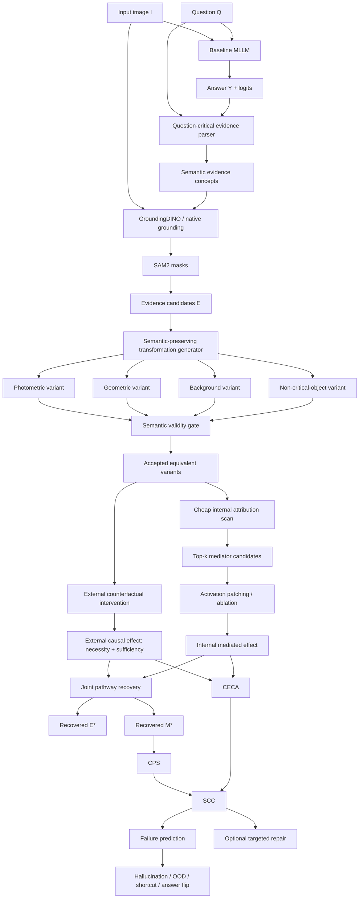

# Same Evidence, Same Circuit?
## End-to-End Architecture for Semantic Causal Pathway Consistency in Multimodal Large Language Models

**Working title**

> **Same Evidence, Same Circuit? Semantic Causal Pathway Consistency for Faithful Multimodal Reasoning**

## 1. Exact research question

> **Do semantically equivalent visual evidence instances activate stable internal causal circuits in an MLLM, and can instability of the evidence-to-circuit mapping predict unfaithful reasoning, hallucination, or out-of-distribution failure better than existing behavioral, semantic, or external-only faithfulness signals?**

For image \(I\), question \(Q\), answer \(Y\), semantic evidence \(E\), internal mediator set \(M\), and a meaning-preserving transformation family \(T\), define the pathway:

\[
\mathcal{P}=(E,M,T,Y)
\]

The central hypothesis is:

\[
\boxed{\text{behavioral invariance} \not\Rightarrow \text{mechanistic invariance}}
\]

A trustworthy model should ideally satisfy:

\[
\text{same semantic evidence}
\Rightarrow
\text{similar causal mechanism}
\Rightarrow
\text{same supported answer}
\]

---

# 2. Main contributions

## Contribution A — Semantic Evidence–Circuit Correspondence

Recover an instance-specific causal pathway:

\[
E^* \rightarrow M^* \rightarrow Y
\]

where:

- \(E^*\): question-critical visual evidence;
- \(M^*\): approximately minimal internal causal mediator set;
- \(Y\): MLLM answer.

## Contribution B — Causal Pathway Stability (CPS)

For semantically equivalent variants, compare the recovered mediator sets.

Hard-set version:

\[
CPS(i,j)=\frac{|M_i^*\cap M_j^*|}{|M_i^*\cup M_j^*|}
\]

Weighted version, using nonnegative isolated mediated restoration effects normalized over the shared layer/head universe:

\[
CPS_w(i,j)=1-JS(P_{M_i},P_{M_j})
\]

where \(JS\) is Jensen-Shannon divergence.

## Contribution C — Causal Evidence–Circuit Alignment (CECA)

Let the external intervention produce causal effect distribution \(P_E^{external}\), and the internal activation-patching intervention produce \(P_{E,M}^{mediated}\).

\[
CECA(E,M)=1-JS(P_E^{external},P_{E,M}^{mediated})
\]

## Contribution D — Semantic Causal Consistency (SCC)

\[
SCC = CECA \times \overline{CPS}
\]

Interpretation:

- high CECA + high CPS: stable grounded reasoning;
- high CECA + low CPS: evidence is used, but through unstable mechanisms;
- low CECA + high CPS: stable mechanism but weak relation to actual visual evidence;
- low CECA + low CPS: likely unfaithful or shortcut-driven reasoning.

Optional later contribution: evidence-conditioned causal repair.

---

# 3. Positioning against nearby work

| Line of work | External evidence | Internal mediator | Cross-instance circuit stability | Main focus |
|---|---:|---:|---:|---|
| CLIP / grounding verification | Yes | No | No | semantic relevance |
| Counterfactual evidence methods | Yes | No | No | evidence-answer consistency |
| Evidence-dropout methods | Yes | No | No | evidence sufficiency |
| Internal causal tracing | Limited | Yes | No | internal mechanism |
| Minimal causal head discovery | Limited | Yes | No | sparse head set |
| **Proposed work** | **Yes** | **Yes** | **Yes** | **semantic evidence-to-circuit correspondence** |

The novelty is **not** CLIP, grounding, masking, activation patching, or head discovery by themselves. The novelty is the **cross-instance semantic-to-mechanistic consistency problem**.

---

# 4. Complete end-to-end architecture



---

# 5. Models to use

## Primary MLLM: Qwen2.5-VL-7B-Instruct

Checkpoint:

```text
Qwen/Qwen2.5-VL-7B-Instruct
```

Why this should be the primary model:

- open weights;
- 7B scale is feasible for repeated causal interventions;
- strong visual reasoning and grounding capability;
- accessible through Hugging Face;
- internal transformer layers can be instrumented with PyTorch hooks;
- large enough to be scientifically meaningful without making the pilot impossible.

Official repository:

https://github.com/QwenLM/Qwen2.5-VL

## Secondary MLLM: LLaVA-OneVision-Qwen2-7B-OV

Checkpoint:

```text
lmms-lab/llava-onevision-qwen2-7b-ov
```

Use this only after the Qwen pipeline is stable. Its purpose is **cross-model confirmation**, not primary development.

## Optional third model

Add one additional open model in the final paper only if resources permit:

- InternVL family;
- another open 7B–13B MLLM with hook-accessible internals.

## Separate text LLM

Not required.

For question decomposition:

1. use structured dataset annotations when available;
2. otherwise use deterministic parsing plus the same open MLLM in text mode;
3. optionally use a small open instruction LLM.

Avoid proprietary APIs in the core pipeline.

---

# 6. Supporting vision models

## CLIP / OpenCLIP

Use for:

- semantic proposal ranking;
- baseline semantic relevance;
- measuring the semantic-vs-causal gap.

Suggested backbone:

```text
ViT-L/14
```

Official CLIP:
https://github.com/openai/CLIP

OpenCLIP:
https://github.com/mlfoundations/open_clip

## GroundingDINO

Use for open-vocabulary phrase grounding.

Official:
https://github.com/IDEA-Research/GroundingDINO

## SAM2

Use for precise evidence-region masks.

Official:
https://github.com/facebookresearch/segment-anything-2

---

# 7. Dataset plan

The datasets serve different roles. Do not train, tune, and evaluate on the same split.

## Dataset A — VQA v2

Use for:

- general natural-image VQA;
- object, attribute, counting, and common reasoning questions;
- diagnostic and surrogate-training data.

### Split protocol

**Training**
- official VQA v2 train split;
- use only if training an amortized mediator predictor or repair module.

**Development / calibration**
- take 40% of labeled validation images.

**Locked mechanistic test**
- remaining 60% of labeled validation images.

Important:

> Split by `image_id`, not by question ID.

That prevents questions from the same image from appearing in both development and held-out evaluation.

If practical, also report standard VQA performance through the official test-dev server.

---

## Dataset B — GQA Balanced

Use because it provides:

- object reasoning;
- attributes;
- spatial relations;
- compositional relations;
- counting;
- scene-graph structure.

### Recommended use

**Training**
```text
train_balanced
```

**Development**
```text
val_balanced development subset
```

**Held-out**
```text
frozen held-out subset of val_balanced
```

If official test-dev evaluation is practical, report that separately.

### Mandatory stratification

Evaluate separately on:

```text
object
attribute
spatial relation
compositional relation
counting
```

---

## Dataset C — Winoground

Use strictly as **OOD compositional evaluation**.

It contains 400 carefully curated examples.

Do not train on it.

Resource:

https://huggingface.co/datasets/facebook/winoground

---

## Dataset D — POPE / POPEv2

Use for object-hallucination evaluation.

POPE:
https://github.com/AoiDragon/POPE

POPEv2:
https://github.com/AoiDragon/POPEv2

POPEv2 is especially useful because the public benchmark includes normal and counterfactual image fields.

Use as evaluation-only data for the diagnostic paper.

---

## Dataset E — UNK-VQA

Use as a secondary unsupported-answer / abstention benchmark.

Purpose:

> Test whether low SCC is more frequent when the question lacks adequate visual evidence.

Do not make UNK-VQA the primary dataset.

---

# 8. Recommended train / validation / test table

| Dataset | Train | Validation / calibration | Locked evaluation |
|---|---|---|---|
| VQA v2 | Official train | 40% of val images | 60% of val images |
| GQA Balanced | train_balanced | val_balanced dev subset | frozen val/test-dev subset |
| Winoground | None | None | all 400 examples |
| POPE / POPEv2 | None for diagnosis | None | official benchmark |
| UNK-VQA | None for diagnosis | optional calibration subset | held-out benchmark |

Commit all split IDs and random seeds before final experiments.

---

# 9. Pilot design

Run a kill-or-continue pilot before building the full paper.

## Pilot size

Use approximately:

```text
200 VQA v2
200 GQA
100 POPEv2
```

Total:

\[
N=500
\]

For each original sample, generate:

\[
K=4
\]

accepted semantic-preserving variants.

Thus:

\[
500 \times (1+4)=2500
\]

base image-question inputs per model before intervention runs.

Start with Qwen2.5-VL only.

---

# 10. Semantic-preserving transformation family

Define:

\[
T_Q=\{t:t(I)\text{ preserves the semantic answer to }Q\}
\]

Do not apply the same transformations blindly to every question.

## T1 — Photometric nuisance

Examples:

- mild brightness;
- contrast;
- JPEG compression;
- small Gaussian noise.

Do **not** apply color-changing transforms to color questions.

## T2 — Geometric nuisance

Examples:

- small translation;
- padding;
- resize;
- safe crop.

Do **not** apply when the question depends on left/right, above/below, relative position, or counting if the edit can alter those semantics.

## T3 — Background replacement

Keep critical evidence masks unchanged.

Modify only background using:

- inpainting;
- diffusion-based replacement;
- context substitution.

Purpose:

> Test whether irrelevant context causes circuit switching.

## T4 — Non-critical object removal/replacement

Remove a visual object that is not needed for the answer.

Example:

Question:
```text
What color is the umbrella?
```

Critical:
```text
umbrella
```

Non-critical:
```text
tree
chair
distant pedestrian
```

## T5 — Semantic exemplar substitution

Optional later experiment.

Replace a critical object with a different exemplar while preserving:

- semantic class;
- relation;
- answer.

Use only after T1–T4 are reliable.

---

# 11. Semantic validity gate

No transformed image enters the CPS analysis without validation.

For transformed image \(I'\):

## Rule 1 — answer preserved

\[
GT(I,Q)=GT(I',Q)
\]

## Rule 2 — critical concept preserved

\[
Presence(c,I')=1
\]

## Rule 3 — required relation/attribute preserved

For relational questions:

\[
Relation(s,r,o,I')=Relation(s,r,o,I)
\]

## Rule 4 — audit

For the pilot:

> manually inspect every transformed example.

For the full benchmark:

- automatically validate easy cases;
- manually inspect ambiguous cases;
- manually audit a large random subset of automatic accepts.

This validation protocol is essential. Weak semantic equivalence invalidates the whole paper.

---

# 12. Stage 0 — Environment

Recommended stack:

```text
Python 3.10/3.11
PyTorch
Transformers
Accelerate
FlashAttention2
OpenCLIP
GroundingDINO
SAM2
scikit-learn
pandas
numpy
```

Use PyTorch hooks or an instrumentation library to support:

```python
save_activation(layer, head, token)
patch_activation(layer, head, token, value)
ablate_activation(layer, head, token)
```

Use BF16 when supported.

---

# 13. Stage 1 — Baseline inference

For each sample:

\[
Y^*=M_\theta(I,Q)
\]

Store:

- answer;
- answer correctness;
- generated tokens;
- token-level logits;
- full answer probability approximation where feasible.

Use deterministic decoding for mechanistic experiments:

```text
temperature = 0
do_sample = false
```

This removes generation noise from causal comparisons.

---

# 14. Stage 2 — Extract question-critical evidence

Represent question requirements structurally.

Example:

Question:

> What color is the umbrella held by the woman?

Representation:

```json
{
  "critical_objects": ["woman", "umbrella"],
  "critical_attributes": ["umbrella.color"],
  "critical_relations": ["woman holding umbrella"],
  "answer_type": "attribute-color"
}
```

For GQA, prefer ground-truth structured annotations where available.

For VQA v2, use deterministic language parsing plus structured MLLM output.

The parser is not a claimed novelty.

---

# 15. Stage 3 — Generate external evidence proposals

For each question-critical concept \(c_i\):

\[
R_i=Ground(I,c_i)
\]

using GroundingDINO.

Generate SAM2 mask:

\[
M_i=SAM2(I,R_i)
\]

Use CLIP as a proposal-ranking baseline:

\[
s_i^{CLIP}
=
\cos(E_I(I\odot M_i),E_T(c_i))
\]

Important:

> CLIP is only a proposal score, not causal ground truth.

---

# 16. Stage 4 — External necessity intervention

For evidence candidate \(E_i\), create a distribution-preserving counterfactual:

\[
\tilde I_{\setminus E_i}
\]

Preferred intervention order:

1. high-quality inpainting;
2. context-preserving blur/replacement;
3. black/gray mask only as an ablation baseline.

Original output distribution:

\[
P_0=P_\theta(Y|I,Q)
\]

Counterfactual:

\[
P_i^-=P_\theta(Y|\tilde I_{\setminus E_i},Q)
\]

Necessity score:

\[
N_i=D(P_0,P_i^-)
\]

Use:

- Jensen-Shannon divergence;
- target-answer log-probability drop;
- answer flip indicator.

---

# 17. Stage 5 — External sufficiency intervention

Retain mainly evidence \(E_i\):

\[
\tilde I_{E_i}
\]

Then:

\[
P_i^+=P_\theta(Y|\tilde I_{E_i},Q)
\]

Define:

\[
S_i=1-D(P_0,P_i^+)
\]

High \(S_i\) means the evidence alone largely preserves the original output behavior.

---

# 18. Stage 6 — Approximate minimal external evidence set

Find:

\[
E^*=\arg\min_E |E|
\]

subject to:

\[
N(E)\ge \tau_N
\]

and:

\[
S(E)\ge \tau_S
\]

Do not use brute-force search on the full dataset.

Use:

```text
Forward greedy selection
    -> add region with largest sufficiency gain

Backward pruning
    -> remove redundant regions while keeping thresholds satisfied
```

For a small subset with few candidates, run exhaustive search to measure approximation quality.

---

# 19. Stage 7 — Cheap internal mediator scan

Potential mediator units:

- projected visual tokens;
- decoder attention heads;
- selected residual states;
- selected MLP blocks.

Start with attention heads because they are easier to index and compare.

For factual and counterfactual runs:

\[
A_{l,h}
=
\|a_{l,h}^{F}-a_{l,h}^{CF}\|_2
\]

or use:

- gradient × activation;
- attribution patching;
- head-output difference.

Select:

\[
\mathcal M_{cand}=TopK(A)
\]

Recommended pilot:

```text
top-k = 20–50 mediator candidates
```

This prevents exhaustive full-network patching.

---

# 20. Stage 8 — Activation patching

Run the factual image:

\[
M(I,Q)
\]

Cache factual mediator activation:

\[
a_m^F
\]

Run counterfactual image:

\[
M(\tilde I_{\setminus E},Q)
\]

Cache:

\[
a_m^{CF}
\]

Patch:

\[
a_m^{CF}\leftarrow a_m^F
\]

In the reference implementation, a mediator is one attention head's channel slice at the input to that layer's `o_proj`. Patching is restricted to prompt-side token positions; forced-answer positions are never patched, which prevents target leakage. This is a broad layer/head intervention across prompt positions, not a single-token or single-edge circuit claim. Factual and counterfactual prompt token sequences must have matching shapes; variants that change image-token layout are excluded or re-grounded and re-aligned before tracing.

Then:

\[
P_m^{patch}
=
P_\theta(
Y|
\tilde I_{\setminus E},
Q,
do(a_m=a_m^F)
)
\]

For the efficient pilot, define the target-answer mediated effect as the change in the fixed target answer's summed continuation log likelihood:

\[
ME(E,m)
=
\log P_m^{patch}(Y^*|I_{cf},Q)-\log P^{CF}(Y^*|I_{cf},Q)
\]

A useful mediator restores part of the target-answer likelihood lost under evidence deletion. This fixed-answer likelihood is a diagnostic, not a normalized probability over every possible response.

---

# 21. Stage 9 — Recover an approximate minimal mediator set

Find:

\[
M^*=\arg\min_M |M|
\]

subject to:

\[
Recovery(E,M)\ge\tau_M
\]

where:

\[
Recovery(E,M)
=
\frac{\log P^{patch(E,M)}(Y^*)-\log P^{CF}(Y^*)}{\log P^F(Y^*)-\log P^{CF}(Y^*)}
\]

Use output-distribution recovery over a fixed, preregistered candidate-answer set as a secondary analysis, not as the full vocabulary distribution.

Greedy algorithm:

```text
M = empty

while Recovery < tau_M:
    test each unused candidate
    select candidate with largest recovery gain
    add it to M

backward-prune M:
    remove any mediator that is not necessary to remain above threshold
```

Report:

- number of mediators;
- recovered causal effect;
- number of forward passes;
- wall-clock time.

---

# 22. Stage 10 — Approximation validation

If candidate count is small:

\[
k\le 12
\]

run exact or beam search.

Compare greedy to optimum:

\[
ApproxRatio
=
\frac{|M_{greedy}|}{|M_{optimal}|}
\]

Also compare causal recovery.

Unless exact optimality is proven, call \(M^*\):

> approximately minimal causal mediator set.

---

# 23. Stage 11 — Recover pathway under each semantic variant

For:

\[
I^{(1)},I^{(2)},...,I^{(K)}
\]

recover:

\[
E_k^*\rightarrow M_k^*\rightarrow Y_k
\]

Only compare variants that passed the semantic validity gate.

---

# 24. Stage 12 — Compute CPS

Hard-set version:

\[
CPS_{hard}
=
\frac{2}{K(K-1)}
\sum_{i<j}
\frac{|M_i^*\cap M_j^*|}{|M_i^*\cup M_j^*|}
\]

Weighted version:

\[
CPS_w
=
1-
\frac{2}{K(K-1)}
\sum_{i<j}
JS(P_M^{(i)},P_M^{(j)})
\]

Use weighted CPS as the main measure. If a variant yields no recovered mediators, its weighted CPS similarity with any variant is zero; shared absence is not evidence of a stable circuit.

Hard Jaccard should be secondary because near-threshold swaps can make hard sets unstable.

---

# 25. Stage 13 — Compute CECA

A simple scalar diagnostic:

\[
CECA_{scalar}
=
\frac{
\min(\Delta^{ext},\Delta^{med})
}{
\max(\Delta^{ext},\Delta^{med})+\epsilon
}
\]

Primary output-distribution version: normalize positive per-answer shifts caused by external deletion and positive per-answer shifts restored by mediator patching, over the same fixed answer candidates and temperature:

\[
P^{external}_{effect}(y)\propto\max(0,P_F(y)-P_{CF}(y)),\quad
P^{mediated}_{effect}(y)\propto\max(0,P_{patch}(y)-P_{CF}(y))
\]
\[
CECA_{dist}=1-\frac{JS(P^{external}_{effect},P^{mediated}_{effect})}{\ln 2}
\]

If either effect has no positive mass, CECA is undefined for that instance and SCC is not reported. Report scalar target-log-likelihood agreement as a diagnostic. Candidate-answer normalization is a restricted comparison distribution, not the model's complete output distribution.

---

# 26. Stage 14 — Compute SCC

\[
SCC=CECA\times CPS_w
\]

This is the principal instance-level mechanistic consistency score.

---

# 27. Stage 15 — Failure prediction

Define failure target:

\[
F_i=1
\]

when a sample later fails under:

- stronger OOD transformation;
- hallucination benchmark;
- counterfactual image;
- answer flip;
- unsupported visual query.

Compare SCC against:

```text
answer entropy
maximum token probability
self-consistency
CLIP image-question similarity
CLIP region-concept similarity
grounding confidence
external necessity only
external sufficiency only
attention magnitude
CPS only
CECA only
```

Metrics:

- AUROC;
- AUPRC;
- Brier score;
- ECE;
- risk-coverage.

The most important empirical result is:

> Does SCC predict failure better than all external-only and internal-only baselines?

---

# 28. Training strategy

## Phase A — Diagnostic core: no training

Freeze:

- Qwen2.5-VL;
- LLaVA-OneVision;
- CLIP;
- GroundingDINO;
- SAM2.

This should be the first complete system.

## Phase B — Amortized mediator predictor

Only after CPS/SCC show strong signal.

Training input:

\[
(I,Q,Y)
\]

plus cheap internal features.

Training target:

- mediator membership;
- or weighted mediated-effect vector.

Train on:

```text
VQA v2 train
GQA train_balanced
```

Validate on dev splits.

Evaluate on locked VQA/GQA plus Winoground/POPE.

## Phase C — Optional causal repair

Only after SCC predicts failure reliably.

Use:

- adapter;
- LoRA;
- activation steering;
- pathway-consistency regularizer.

Do not fine-tune the entire model initially.

---

# 29. Amortized mediator predictor

Input features may include:

```text
question embedding
answer embedding
pooled visual representation
factual-counterfactual activation deltas
cheap head-attribution scores
```

Output:

\[
\hat w\in[0,1]^{L\times H}
\]

Evaluate:

- Recall@K;
- Precision@K;
- causal-effect recovery using predicted mediators;
- speedup vs full patching.

This is a scalability contribution, not the primary diagnostic novelty.

---

# 30. Optional evidence-conditioned repair

If:

\[
SCC<\tau_{SCC}
\]

and a reference faithful pathway exists, apply targeted intervention.

One conceptual form:

\[
a_{M^*}'=
a_{M^*}
+
\alpha(
a_{M^*}^{faithful}
-
a_{M^*}^{current}
)
\]

Alternative consistency loss across valid semantic variants:

\[
\mathcal L
=
\mathcal L_{task}
+
\lambda_{cc}
JS(P_M^{(i)},P_M^{(j)})
\]

Goal:

\[
\text{same semantic evidence}
\Rightarrow
\text{more consistent causal pathway}
\]

Repair is secondary to the measurement paper.

---

# 31. Pilot hypotheses

## H1 — Behavioral vs mechanistic invariance

Correct-answer-preserving semantic variants can still yield low CPS.

## H2 — Semantic relevance differs from causal relevance

Measure:

\[
\rho(s^{CLIP},\Delta_E)
\]

Do not assume it will be low; estimate it.

## H3 — Sparse mediation

A small mediator subset recovers a large portion of the external causal effect.

## H4 — SCC predicts failure

Low SCC predicts hallucination/OOD/counterfactual failure better than conventional confidence and external-only causal baselines.

H4 is the most important publication hypothesis.

---

# 32. Kill-or-continue criteria

Proceed if one or more strong, reproducible signals appear:

1. a substantial fraction of correct semantic variants show low CPS;
2. CLIP semantic relevance and causal relevance disagree meaningfully;
3. sparse mediator sets recover substantial external causal effect;
4. SCC predicts later failures better than baseline confidence metrics;
5. different question types show systematic pathway-stability differences.

Pivot if:

- CPS is consistently high when the answer is correct;
- SCC predicts nothing useful;
- semantic-preserving variants cannot be validated reliably;
- mediator recovery is unstable under repeated runs;
- compute cost remains impractical after top-k pruning.

---

# 33. Mandatory baselines

## Behavioral
- max answer confidence;
- token entropy;
- self-consistency.

## Semantic
- CLIP image-question similarity;
- CLIP region-concept similarity;
- grounding confidence.

## External causal
- mask-based necessity;
- inpaint-based necessity;
- sufficiency/dropout.

## Internal
- attention magnitude;
- gradient × activation;
- single-head causal attribution;
- top-k attribution patching.

## Proposed
- CPS;
- CECA;
- SCC.

---

# 34. Ablation plan

Run:

```text
mask vs inpainting
box vs SAM mask
CLIP proposal vs random region proposals
top-k = 10 / 20 / 50 / 100
attention-head-only vs residual-state mediators
hard CPS vs weighted CPS
single transformation family vs multiple families
greedy vs beam-search pathway recovery
Qwen vs LLaVA
```

---

# 35. Question-type analysis

Report separately:

```text
object existence
attribute
color
counting
spatial relation
action relation
compositional relation
OCR/text
```

This can reveal whether abstract/compositional semantics require more distributed or less stable circuits.

---

# 36. Model-scale analysis

After the main result works, test different scales where feasible:

```text
3B
7B
13B+ or comparable larger open model
```

Research question:

> Does scale improve mechanistic stability, or only behavioral accuracy?

Do not add this before the pilot works.

---

# 37. Statistical analysis

For correlations report:

- Spearman \(\rho\);
- Pearson \(r\);
- bootstrap 95% confidence intervals.

For repeated semantic variants from the same source image, do not treat all variants as independent.

Use:

- paired Wilcoxon signed-rank;
- mixed-effects models when appropriate;
- paired bootstrap for metric comparisons.

For failure-prediction comparisons report bootstrap AUROC/AUPRC differences.

---

# 38. Cost reporting

Mandatory for this project:

```text
forward passes per sample
GPU seconds per sample
peak VRAM
wall-clock time per 100 samples
cost before/after top-k pruning
```

A causal method that requires thousands of passes per sample will be attacked on practicality.

---

# 39. Recommended repository structure

```text
semantic-causal-pathways/
│
├── configs/
│   ├── qwen25vl.yaml
│   ├── llava_onevision.yaml
│   ├── datasets.yaml
│   ├── transformations.yaml
│   └── interventions.yaml
│
├── data/
│   ├── vqav2/
│   ├── gqa/
│   ├── winoground/
│   ├── pope/
│   └── unk_vqa/
│
├── src/
│   ├── models/
│   │   ├── qwen25vl.py
│   │   └── llava_onevision.py
│   │
│   ├── evidence/
│   │   ├── question_parser.py
│   │   ├── clip_proposals.py
│   │   ├── grounding_dino.py
│   │   └── sam2_masks.py
│   │
│   ├── transforms/
│   │   ├── photometric.py
│   │   ├── geometric.py
│   │   ├── background.py
│   │   └── validity.py
│   │
│   ├── causal/
│   │   ├── external_effect.py
│   │   ├── interventions.py
│   │   ├── activation_cache.py
│   │   ├── attribution_scan.py
│   │   ├── activation_patch.py
│   │   └── mediator_search.py
│   │
│   ├── metrics/
│   │   ├── cps.py
│   │   ├── ceca.py
│   │   ├── scc.py
│   │   └── calibration.py
│   │
│   └── prediction/
│       ├── failure_predictor.py
│       └── mediator_surrogate.py
│
├── scripts/
│   ├── 01_prepare_data.py
│   ├── 02_run_baseline.py
│   ├── 03_extract_evidence.py
│   ├── 04_generate_variants.py
│   ├── 05_validate_variants.py
│   ├── 06_external_interventions.py
│   ├── 07_rank_mediators.py
│   ├── 08_activation_patching.py
│   ├── 09_recover_pathways.py
│   ├── 10_compute_cps_ceca_scc.py
│   ├── 11_failure_prediction.py
│   ├── 12_run_ablations.py
│   └── 13_train_surrogate.py
│
└── outputs/
    ├── baseline/
    ├── transformations/
    ├── interventions/
    ├── circuits/
    ├── metrics/
    └── figures/
```

---

# 40. Per-sample result schema

```json
{
  "sample_id": "example_001",
  "model": "Qwen2.5-VL-7B-Instruct",
  "question": "What color is the umbrella?",
  "gt_answer": "red",
  "model_answer": "red",
  "correct": true,

  "critical_evidence": [
    {
      "concept": "umbrella",
      "clip_score": 0.62,
      "external_necessity": 0.41,
      "external_sufficiency": 0.88
    }
  ],

  "mediators": [
    {
      "layer": 18,
      "head": 7,
      "mediated_effect": 0.25
    },
    {
      "layer": 20,
      "head": 3,
      "mediated_effect": 0.18
    }
  ],

  "ceca": 0.81,
  "cps_hard": 0.43,
  "cps_weighted": 0.76,
  "scc": 0.62,

  "variant_results": [
    {
      "transform": "background_replace",
      "answer_same": true,
      "cps_weighted": 0.51
    }
  ]
}
```

---

# 41. Implementation order

Follow this sequence.

## Phase 1
Baseline Qwen2.5-VL inference on VQA v2 and GQA.

## Phase 2
Implement and validate activation capture, ablation, and patching on 20 samples.

## Phase 3
Implement question-critical evidence extraction, GroundingDINO, SAM2, and CLIP proposal scoring.

## Phase 4
Implement mask and inpainting external interventions. Compare artifacts.

## Phase 5
Implement cheap mediator ranking and top-k pruning.

## Phase 6
Run activation patching on approximately 50 samples.

## Phase 7
Implement semantic-preserving transformations and validity checks.

## Phase 8
Run the full 500-sample pilot:
- CLIP relevance;
- external causal effect;
- mediated effect;
- CPS;
- CECA;
- SCC.

## Phase 9
Only if the pilot succeeds, repeat core experiments with LLaVA-OneVision.

## Phase 10
Expand to Winoground, POPE/POPEv2, and UNK-VQA.

## Phase 11
Train an amortized mediator predictor only if cost is clearly limiting.

## Phase 12
Add evidence-conditioned repair only if SCC reliably predicts failure.

---

# 42. Resource estimate

For the pilot, a practical target is:

```text
1 × 48–80 GB GPU
```

or multiple smaller GPUs with model sharding.

Use:

- BF16;
- cached factual activations;
- FlashAttention2 for standard inference;
- top-k mediator pruning;
- batched interventions where architecture permits.

Do not begin with 32B/72B models.

---

# 43. Main figures for the paper

## Figure 1
Full semantic evidence → causal circuit → answer pipeline.

## Figure 2
A visually compelling example of:

```text
same evidence
same correct answer
different internal circuit
```

## Figure 3
Three-way relationship:

```text
CLIP relevance
vs
external causal effect
vs
internal mediated effect
```

## Figure 4
CPS distributions for:
- correct-stable;
- correct-unstable;
- incorrect samples.

## Figure 5
SCC versus future failure probability.

## Figure 6
Layer × head mediated-effect maps across semantic variants.

## Figure 7
2×2 CECA/CPS failure taxonomy.

---

# 44. Main tables

## Table 1
Related-work capability comparison.

## Table 2
Failure-prediction results:

```text
entropy
CLIP
grounding
external causal effect
CPS
CECA
SCC
```

## Table 3
Cross-model results:

```text
Qwen2.5-VL
LLaVA-OneVision
```

## Table 4
Runtime and forward-pass cost.

## Table 5
Question-type breakdown.

---

# 45. What should be the base paper?

There is no single recent paper that should be treated as the complete base architecture because your novelty sits **between** multiple lines.

Use the uploaded **Fang et al. TCSVT 2025** paper as the **visual concept-grounding base**.

Use **SIRI (TMM 2026)** as the reasoning-motivation paper.

Use **UNK-VQA** as the unsupported-answer motivation.

Use recent external-counterfactual and internal-causal papers as direct baselines in the final related-work section.

Your own contribution begins at:

\[
\boxed{
\text{semantic evidence}
\leftrightarrow
\text{internal causal circuit}
}
\]

across semantically equivalent instances.

---

# 46. What you are specifically solving

Do not say:

> We reduce all MLLM hallucination.

Say:

> **We study whether an MLLM uses a stable internal causal mechanism when the same question-critical visual evidence is presented under meaning-preserving changes, and whether instability of that pathway predicts later reasoning failures.**

That is narrow, falsifiable, and defensible.

---

# 47. Final compact pipeline

\[
(I,Q)
\]

\[
\downarrow
\]

\[
Y=M_\theta(I,Q)
\]

\[
\downarrow
\]

\[
\text{Question-critical semantic evidence }E
\]

\[
\downarrow
\]

\[
\text{Ground + segment }E
\]

\[
\downarrow
\]

\[
\text{Generate valid semantic-preserving variants }T_Q(I)
\]

\[
\downarrow
\]

\[
\text{External causal intervention}
\]

\[
\downarrow
\]

\[
\Delta_E
\]

\[
\downarrow
\]

\[
\text{Cheap mediator ranking}
\]

\[
\downarrow
\]

\[
\text{Activation patching}
\]

\[
\downarrow
\]

\[
M^*
\]

\[
\downarrow
\]

\[
\boxed{E^*\rightarrow M^*\rightarrow Y}
\]

for each semantic-preserving variant.

Then compute:

\[
\boxed{CPS}
\]

for pathway stability,

\[
\boxed{CECA}
\]

for external/internal causal alignment,

and:

\[
\boxed{SCC=CECA\times CPS}
\]

for overall semantic causal consistency.

Finally evaluate:

\[
\boxed{SCC\rightarrow\text{failure prediction}}
\]

against behavioral, semantic, external-causal, and internal-only baselines.

---

# 48. The decisive experiment

Run:

\[
500\text{ originals}\times4\text{ valid variants}\times1\text{ primary MLLM}
\]

and answer:

1. How often does the answer remain correct while CPS becomes low?
2. Does low SCC predict harder OOD/counterfactual failure?
3. Does SCC outperform entropy, CLIP relevance, grounding confidence, and external causal effect as a predictor?

If Questions 1 and 2 produce a strong reproducible signal, proceed to the full paper.

If not, pivot before investing in the repair and amortization modules.

---

# 49. Recommended first-paper scope

Keep the first paper focused on:

1. formalizing semantic evidence-to-circuit correspondence;
2. efficiently recovering approximate causal pathways;
3. defining CPS, CECA, and SCC;
4. demonstrating behavioral-versus-mechanistic mismatch;
5. testing whether SCC predicts failure.

Treat:

- surrogate mediator prediction;
- causal repair;
- full end-to-end training;

as optional extensions unless the core diagnostic study is already strong.

---

# 50. Public resources

- Qwen2.5-VL: https://github.com/QwenLM/Qwen2.5-VL
- LLaVA-OneVision: https://github.com/LLaVA-VL/LLaVA-NeXT
- GroundingDINO: https://github.com/IDEA-Research/GroundingDINO
- SAM2: https://github.com/facebookresearch/segment-anything-2
- CLIP: https://github.com/openai/CLIP
- OpenCLIP: https://github.com/mlfoundations/open_clip
- Winoground: https://huggingface.co/datasets/facebook/winoground
- POPE: https://github.com/AoiDragon/POPE
- POPEv2: https://github.com/AoiDragon/POPEv2

---

# 51. Final recommendation

The project should begin **training-free and diagnostic**, not as a new end-to-end MLLM.

Start with:

```text
Qwen2.5-VL-7B-Instruct
+ VQA v2
+ GQA
+ 500-sample validated semantic-variant pilot
+ external causal intervention
+ top-k mediator search
+ activation patching
+ CPS / CECA / SCC
```

Only if SCC reveals a strong mechanistic signal should you invest in:

```text
second MLLM
larger benchmark suite
amortized recovery
repair
```

This keeps the research falsifiable, computationally manageable, and focused on the strongest available novelty: **whether semantically equivalent visual evidence is implemented by stable causal mechanisms inside MLLMs, and whether instability of those mechanisms predicts failure before behavioral metrics do.**

---

# 52. Prototype implementation status and executable pathway

The repository contains a runnable diagnostic prototype for the core pathway, not a complete execution of every phase in this architecture. The notebook is executable cell by cell, and the manifest runner processes reviewed examples on a Windows machine. Data, masks, and checkpoints remain user-provided: this repository does not download, annotate, or redistribute the VQA/GQA image sets. Paths can be portable relative paths or machine-specific absolute paths in configuration/JSONL. The causal run loads models only when enabled.

The causal pathway is interpreted narrowly and operationally:

1. **Question to semantic requirements:** `evidence.py` supplies a transparent heuristic baseline. Dataset annotations and human review remain the authoritative critical-object, attribute, and relation specification; the heuristic is not presented as a validated parser.
2. **Requirements to external evidence:** Grounding DINO proposes boxes and SAM2 proposes masks. Optional CLIP region cosine is a proposal ranking signal. None of those scores is treated as a concept truth label.
3. **Semantic-preserving variants:** mild photometric variants are provided. Every variant is rejected unless answer preservation, evidence preservation, relation preservation, and human audit are explicitly true. Geometry-changing variants require new grounding and mask alignment.
4. **External intervention:** necessity compares a fixed candidate-answer distribution for the original and same-canvas evidence-deleted image. Sufficiency compares the original distribution to an evidence-only image. Area/shape matched translated masks are controls and must be visually checked for other critical evidence.
5. **Internal mediator scan:** the Qwen adapter caches the concatenated per-head inputs to attention `o_proj` on factual and counterfactual runs. It rejects mismatched token-sequence shapes. Mediator candidates are ranked by activation-difference norm.
6. **Activation patching:** selected layer/head channel chunks are replaced from the factual run into the counterfactual run at prompt positions only. Answer-token positions are never patched. This avoids direct target leakage but remains a broad layer/head intervention and an approximation to a causal circuit.
7. **Mediator recovery:** forward greedy selection plus backward pruning maximizes restoration of the fixed target answer's summed log likelihood. An exact subset search is provided only for small candidate sets. The reported set is approximate unless exact search proves otherwise.
8. **CPS:** weighted CPS uses isolated patch-mediated target-answer restoration weights per recovered head, not attribution magnitude. Empty recovered pathways score zero similarity; shared absence is not circuit stability.
9. **CECA:** primary CECA compares positive external answer-bin shifts after deletion with positive shifts restored by patching, normalized over the same fixed candidate answers. Scalar target-log-likelihood effect agreement is diagnostic. If either effect distribution is empty, CECA and SCC are undefined for that instance.
10. **SCC and failure prediction:** SCC is computed only when both weighted CPS and CECA are defined. Metric primitives and leakage-aware feature/predictor utilities exist, but the batch runner does not yet orchestrate train-only predictor fitting, validation threshold selection, locked-test scoring, dataset-level aggregation, or grouped confidence intervals. These are research analysis steps still to be completed before claims about failure prediction.

The operational path is `scripts/prepare_variants.py` → human review in its CSV → `scripts/apply_variant_review.py` → `scripts/run_experiment.py`. A sample needs a fixed answer candidate set, four approved variants under the default pilot config, and a reviewed evidence mask. The run appends per-sample JSONL and resumes by sample ID. The notebook exposes this runner in its final cell. The full recommended 500-sample pilot, secondary LLaVA condition, dataset acquisition, annotation workflow, benchmark metrics, and confirmatory statistical analysis have not been run or implemented as one-click automation.

## Important interpretation limits

- Candidate-answer normalization is a restricted comparison distribution, never the model's full output distribution. The set must be fixed before comparing interventions.
- Summed answer log likelihood has length effects. Use the same target answer across factual, counterfactual, and patched passes; use multiple fixed alternatives for distributional analysis.
- Blur, gray replacement, and evidence-only backgrounds are out-of-distribution interventions. Compare methods and controls; do not interpret a single mask result as proof of necessity.
- Attention-head input patches intervene on all prompt positions for the selected head. They do not identify a unique token-level circuit or establish causal mediation without additional assumptions and controls.
- Semantic validity and critical-mask quality are bottlenecks. Human audit, mask provenance, and rejected-variant reporting are mandatory.
- The end-to-end model-weighted study has not been run by creating the scaffold. No accuracy, pathway-stability, or failure-prediction claim is made until the user's datasets and checkpoints are configured and the experiments are executed.

The repository README explains Windows setup, data placement, and staged notebook execution. The notebook emits per-instance JSON with intervention distributions, mediator sets, CPS/CECA/SCC, and measured model-forward time/count.
