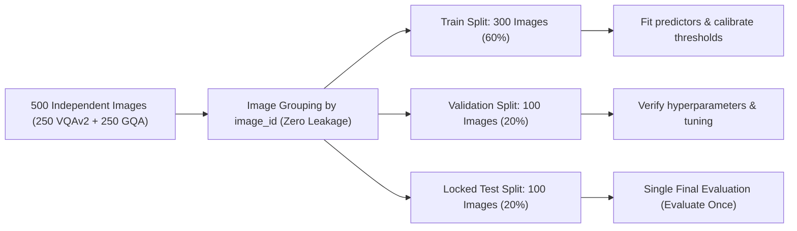

# Preregistered Confirmatory Protocol: 500-Image Semantic Causal Pathway Study

**Protocol Version**: 1.0-confirmatory-500  
**Registration Date**: 2026-10-06  
**Status**: **FROZEN & LOCKED PRIOR TO MODEL INFERENCE**  
**Repository Revision**: `commit 3c4490f`  
**Primary Config**: `configs/confirmatory_protocol_500.json`

---

## 1. Study Stage and Core Research Question

Multimodal Large Language Models (VLMs) frequently output identical, correct textual answers when presented with subtle visual variations. However, behavioral stability does not imply mechanistic stability. This confirmatory study rigorously tests the **Semantic Causal Pathway Hypothesis**:

> **Primary Research Question**:  
> Among instances where a VLM produces a correct and behaviorally invariant answer across human-reviewed meaning-preserving visual perturbations, does internal attention-head causal mediation remain stable, and does the joint external-to-internal pathway score ($\text{SCC}$) predict failure under a disjoint, unseen transformation family significantly better than behavioral consistency, uncertainty, visual grounding, and external necessity baselines?

---

## 2. Hypotheses and Primary/Secondary Metrics

### Primary Hypothesis ($H_1$)
Higher degradation in internal semantic causal pathways (low $\text{SCC}$) on meaning-preserving probe variants is positively associated with generalization failure under held-out transformation families, providing superior predictive validity (measured by AUROC, AUPRC, and Brier score) compared to:
1. Probe Behavioral Inconsistency ($1 - \text{Probe Consistency}$)
2. Maximum Candidate Probability / Confidence ($1 - \max P$)
3. Normalized Output Entropy ($H / \log K$)
4. External Evidence Necessity alone (Jensen-Shannon divergence under critical mask ablation)
5. Control-Adjusted Necessity ($\max(0, \text{Necessity}_{\text{evidence}} - \text{Necessity}_{\text{control}})$)

### Primary Metric
$$\text{SCC} = \text{Distribution CECA} \times \text{Weighted CPS}$$
Calculated strictly when both component metrics are defined. Range: $[0, 1]$.
- **Distribution CECA** (Causal Effect-to-Circuit Alignment):
  $$\text{CECA}_{\text{dist}} = 1 - \frac{\text{JS}(P_{\text{full}} \parallel P_{\text{patched}})}{\text{JS}(P_{\text{full}} \parallel P_{\text{deleted}}) + \epsilon}$$
- **Weighted CPS** (Causal Pathway Stability):
  $$\text{CPS}_{\text{weighted}} = \frac{\sum_h \min_{v} w_{v, h}}{\sum_h \max_{v} w_{v, h}}$$
  where $w_{v, h} = \max(0, \log P(\text{pred} \mid \text{patched}_{v, h}) - \log P(\text{pred} \mid \text{deleted}_v))$.

### Secondary Metrics
- **Hard CPS**: Jaccard similarity across discrete recovered mediator sets across variants: $\frac{|\bigcap_v M_v|}{|\bigcup_v M_v|}$.
- **External Necessity**: $\text{JS}(P_{\text{factual}} \parallel P_{\text{deleted}})$.
- **Control-Adjusted Necessity**: $\max(0, \text{JS}_{\text{evidence}} - \text{JS}_{\text{control}})$.
- **Probe Behavioral Consistency**: Fraction of probe variants maintaining the baseline text prediction.

---

## 3. Failure Outcome Definition

1. **Eligible Evaluation Cohort**:  
   Strictly restricted to **baseline-correct instances** ($\text{VQA Consensus Score} \ge 0.5$ on the clean original image). Baseline-incorrect items are excluded from failure prediction and reported separately under baseline accuracy.
2. **Primary Failure Criterion**:  
   An eligible instance is deemed a **held-out failure** ($\text{Failure} = 1$) if the VLM achieves a VQA consensus score $< 0.5$ on **at least one** approved variant in the held-out transformation family.
3. **Secondary Failure Criterion**:  
   Answer flip: The generated prediction on any held-out variant does not match the baseline answer string.
4. **Scope Limitation**:  
   This outcome measures transformation-family generalization to disjoint geometric shifts. It explicitly does not claim open-domain out-of-distribution (OOD) detection or unconstrained hallucination prediction.

---

## 4. Dataset Sampling and Image-Level Split Protocol

### Independent Analysis Unit
- **Independent Unit**: `image_id`. Exactly 1 question per image.
- **Total Sample Size**: $N = 500$ independent images:
  - **VQAv2**: 250 independent images.
  - **GQA**: 250 independent images.

### Zero-Leakage Split Allocation
The 500 independent images are split deterministically via random seed 17 before model inference:
- **Train Split**: 300 images (60.0%)
- **Validation Split**: 100 images (20.0%)
- **Locked Test Split**: 100 images (20.0%)

> [!IMPORTANT]
> **Strict Split Isolation**: All variants, evidence masks, spatial controls, questions, candidate answer bins, and model forward passes for an image belong exclusively to one split partition. Test partition is unlocked and evaluated **strictly once**.

---

## 5. Variant Protocol and Disjoint Transformation Families

Every sample requires candidate variant generation and human review into strictly disjoint probe and held-out families:

| Role | Transformation Family | Type | Specific Variants |
| :--- | :--- | :--- | :--- |
| **Probe** | `jpeg_compression` | Photometric | `jpeg_quality_92`, `jpeg_quality_98` |
| **Held-Out** | `translation` | Geometric | `translate_left_2pct`, `translate_right_2pct` |

### Acceptance / Rejection Gates
Every candidate variant must pass four binary checks signed off by the reviewer:
1. `answer_preserved`: Is the visual answer unequivocally identical to the ground truth?
2. `critical_evidence_preserved`: Does the question-critical visual evidence remain intact, unobscured, and sharp?
3. `relations_preserved`: Are spatial, semantic, and contextual relationships preserved without distortion?
4. `human_audited`: Reviewed and logged with timestamp and reviewer identity.

### Rejection Audit
Negative/degraded candidates (`jpeg_quality_10`, `jpeg_quality_20`, `translate_left_15pct`, `contrast_2.0`) are generated and evaluated to track rejection reasons:
- `severe_compression_artifacts_degraded_semantic_evidence`
- `edge_blurring_obscures_critical_attributes`
- `critical_evidence_truncated_by_image_boundary`
- `pixel_saturation_clipped_texture_features`
- `non_disjoint_or_unassigned_transform_family`

Audit metrics logged to `variant_rejection_audit.json`.

---

## 6. Spatial Controls and Candidate Answer Sets

### Spatial Controls
- Exactly 5 reviewed spatial control masks per instance.
- Generated via translated bounding masks of matching size and shape placed on irrelevant background regions without overlapping the critical evidence mask.
- Verified to ensure $\text{Necessity}_{\text{control}} \approx 0$.

### Preregistered Candidate Answers
- Closed-world candidate answer bins frozen before inference without consulting gold answers or model predictions.
- Structured into 3–12 task-relevant bins plus an explicit `other` distractor bin.
- Logged with timestamp in `candidate_answer_review.csv`.

---

## 7. Statistical Evaluation and Baseline Comparisons

### Predictor Benchmarks
Each baseline predictor is evaluated on its ability to classify held-out failures:
1. **Low SCC**: $1 - \text{SCC}$
2. **Low CPS**: $1 - \text{CPS}_{\text{weighted}}$
3. **Control-Adjusted Necessity**: $\max(0, \text{JS}_{\text{evidence}} - \text{JS}_{\text{control}})$
4. **External Necessity**: $\text{JS}(P_{\text{factual}} \parallel P_{\text{deleted}})$
5. **Probe Behavioral Inconsistency**: $1 - \text{Probe Consistency}$
6. **Low Confidence**: $1 - \max P(\text{candidate})$
7. **Normalized Answer Entropy**: $H(P) / \log K$

### Confidence Intervals
- **Method**: Grouped non-parametric bootstrap (1,000 resamples clustered at image level).
- **Reported Statistics**: AUROC, AUPRC, Brier Score, and empirical 95% bootstrap confidence intervals $[CI_{2.5\%}, CI_{97.5\%}]$.

---

## 8. Model Checkpoints and Execution Parameters

- **Vision-Language Model**: `Qwen/Qwen2.5-VL-7B-Instruct` (architecture: `qwen2_5_vl`, float16/bfloat16).
- **Evidence Proposer**: `IDEA-Research/grounding-dino-tiny` + `facebook/sam2.1-hiera-tiny`.
- **Region Verification**: `openai/clip-vit-large-patch14`.
- **Intervention Method**: Gaussian blur on critical evidence mask.
- **Attention Heads Search**: Greedy mediator search, top-k = 20 heads, recovery threshold = 0.8.
- **Random Seed**: 17 across sampling, controls, and bootstrap.
- **Hardware Target**: NVIDIA RTX 3090 24GB.

---

## 9. Preregistration Lock Statement

This protocol is frozen prior to the generation and inspection of any confirmatory test outcomes. All image groups, splits, candidate bins, transformation families, and evaluation metrics are permanently recorded in this artifact and in `configs/confirmatory_protocol_500.json`. No post-hoc alterations to splits or failure definitions will occur.
