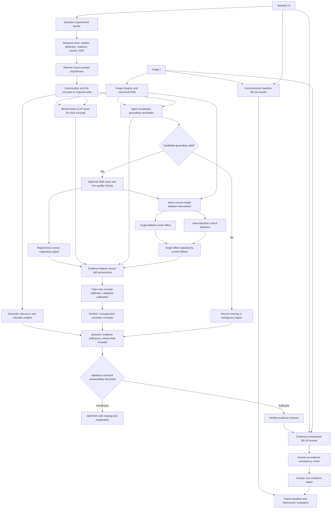

# Semantic and causal evidence pathway

## Purpose and claim boundary

This pathway turns a natural-language visual question into explicit evidence requirements, links each requirement to candidate image regions, tests whether those pixels affect a frozen vision-language model's concept score, and passes only supported evidence to an answer model. It separates **semantic relevance**, **visual localization**, **model-score sensitivity**, **concept verification**, and **answer selection**. These stages answer different questions and their scores must not be treated as interchangeable.

The causal experiment estimates a local intervention effect on a model score. It does **not** prove that the semantic concept is true, that the localized object caused the scene, or that an answer is correct. The paper should use terms such as *deletion sensitivity* or *intervention-based score effect* unless stronger causal assumptions are justified.

## Complete pathway



## Structural causal view

Let (I) be the observed image, (Q) the question, (R(Q)) the structured requirements, (C(Q)) the candidate concepts, and (B_i) a proposed region for concept (c_i). A frozen scorer produces (f(I,c_i)), such as cosine similarity between image and text embeddings. The detector and segmenter produce a mask (M_i); they propose an intervention target but do not certify it.

The target deletion is a pixel intervention on the original full frame:

\[
I_i^{-}=\operatorname{Replace}(I,M_i,\text{blur/inpaint/neutral}),\qquad
\Delta_i^{target}=f(I,c_i)-f(I_i^{-},c_i).
\]

Use the *same image canvas, scorer, text prompt, resize policy, and normalization* in both terms. A crop score can be recorded separately as regional evidence, but it must never be subtracted from a full-frame score and called an intervention effect.

For (K) area-matched control masks (M_{ik}^{ctrl}), preferably outside the candidate region and sampled across the valid image, calculate:

\[
\Delta_{ik}^{ctrl}=f(I,c_i)-f(\operatorname{Replace}(I,M_{ik}^{ctrl}),c_i),\quad
\Delta_i^{adj}=\Delta_i^{target}-\frac{1}{K}\sum_k\Delta_{ik}^{ctrl}.
\]

Report the target effect, each control effect, control mean/standard deviation, and adjusted effect. Positive adjusted effect means the target deletion changes the score more than typical control deletions. It remains sensitive to mask error, occlusion, inpainting artifacts, model preprocessing, and interactions between objects. Repeat with more than one replacement method where feasible (blur and inpaint are distinct interventions), and show sensitivity analyses.

## Semantic pathway and answerability

1. Parse the question into **required slots**, including entity, queried attribute, relation, count, text/OCR, and external-knowledge requirements. Keep uncertainty for each slot.
2. Propose minimal observable concepts and map each concept to the slot(s) it supports. A fluent candidate answer is not evidence.
3. Ground entities/attributes, then separately verify relationships. For relation triples ((s,r,o)), preserve subject/object boxes and use pairwise visual verification; geometric heuristics alone cannot prove predicates such as *holding* or *riding*.
4. Store evidence signals with provenance and raw values: global cosine, regional cosine, detector score, mask quality, target/control deletion effects, prompt/image stability, and optional independent-model results. Missing signals are null, never silently treated as a negative observation.
5. Train concept/answerability calibration only on train data and select all thresholds on validation. The test set is used once for final reporting.
6. Compute sufficiency over **required slots**, not an unweighted mean of arbitrary generated phrases. A critical missing slot (for example, queried color or required relation) can force abstention even when object presence is certain.
7. The MLLM receives verified concepts, regions, confidence provenance, and unresolved required slots. Its answer confidence is evaluated separately from visual evidence confidence.

## Required output record

```json
{
  "question_id": "q17",
  "question": "Is the person holding an umbrella?",
  "requirements": [
    {"slot": "person", "critical": true, "status": "verified"},
    {"slot": "umbrella", "critical": true, "status": "verified"},
    {"slot": "holding(person, umbrella)", "critical": true, "status": "uncertain"}
  ],
  "concept_evidence": [{
    "concept": "umbrella",
    "box_xyxy_pixels": [120, 20, 280, 210],
    "global_clip_cosine": 0.27,
    "region_clip_cosine": 0.31,
    "grounding_score": 0.82,
    "mask_quality": 0.74,
    "intervention": {
      "method": "blur_target_mask_on_full_frame",
      "target_deletion_effect": 0.06,
      "control_deletion_effects": [0.01, -0.01, 0.00],
      "control_adjusted_effect": 0.0633,
      "interpretation": "model_score_sensitivity_only"
    },
    "calibrated_support_probability": null
  }],
  "evidence_sufficiency": null,
  "decision": "abstain",
  "missing_evidence": ["holding(person, umbrella)"],
  "answer": "ABSTAIN"
}
```

Do not fill `calibrated_support_probability` until a calibrator has been fitted and evaluated. The starter's heuristic scores are diagnostic only.

## Research comparisons

- Compare full-frame global CLIP, crop/mask regional CLIP, target deletion effect, and control-adjusted deletion effect as separate predictors of concept labels.
- Include positive-region deletion, matched irrelevant-region deletion, wrong-region deletion, and synthetic concept-injection controls.
- Evaluate question-slot recall and critical-slot failure, not only aggregate concept precision.
- Measure answerability AUROC, selective risk/coverage, calibration, VQA score, and subgroup performance by question type.
- Use paired bootstrap confidence intervals; preserve examples where the detector is wrong, the intervention is artifact-sensitive, or the MLLM answers despite a missing critical slot.
