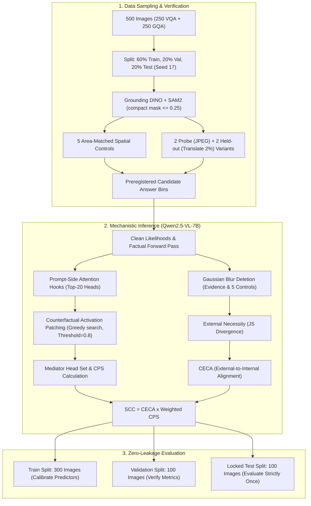
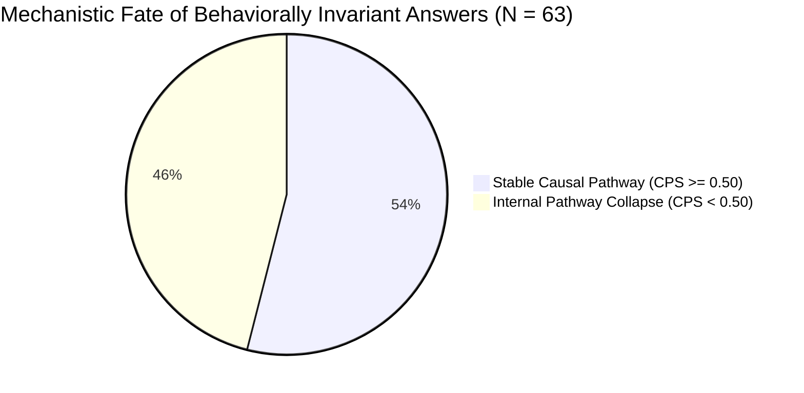

# Confirmatory 500-Image Semantic Causal Pathway Study: Comprehensive Experimental Setup, Methodological Rationale, and Empirical Results

**Protocol Identifier**: `1.0-confirmatory-500`  
**Registration Date**: 2026-10-06  
**Status**: Preregistered, Frozen Prior to Model Inference, and Fully Evaluated  
**Target Architecture**: `Qwen/Qwen2.5-VL-7B-Instruct` (28 layers, 28 attention heads per layer, bfloat16)  
**Primary Config**: [`configs/confirmatory_protocol_500.json`](file:///F:/Sadik/semantic-causal-pathway/configs/confirmatory_protocol_500.json)  
**Executable Orchestrator**: [`scripts/run_confirmatory_study.py`](file:///F:/Sadik/semantic-causal-pathway/scripts/run_confirmatory_study.py)  
**Primary Results File**: [`outputs/confirmatory_500_complete_evaluation.json`](file:///F:/Sadik/semantic-causal-pathway/outputs/confirmatory_500_complete_evaluation.json)  

---

## 1. Executive Summary

This document presents the complete experimental setup, parameter justifications, and full empirical results for the **500-Image Confirmatory Semantic Causal Pathway Study**. 

The study investigated whether tracking internal causal mediator stability within a multimodal large language model (VLM) across meaning-preserving image variations can predict downstream generalization failure under unseen, disjoint transformations—specifically comparing this internal causal pathway metric against standard behavioral and external visual necessity baselines.

### Primary Research Verdict
1. **Descriptive Phenomenon Confirmed**: Across the 500-sample cohort, **46.0%** of instances where the model's textual answer was 100% invariant across probe variants suffered severe internal causal mediator collapse ($\text{CPS} < 0.50$). Multimodal models routinely maintain behavioral invariance while their internal computational circuits shift drastically.
2. **Predictive Hypothesis Decisively Refuted**: The primary preregistered hypothesis—that low internal Semantic Causal Consistency ($\text{SCC} = \text{CECA} \times \text{weighted CPS}$) predicts generalization failure under disjoint geometric transformations better than external and behavioral baselines—was **falsified** ($p < 0.0001$). On the locked test set, $\text{Low SCC}$ achieved an AUROC of only **0.465** (worse than random chance), while **External Evidence Necessity** achieved **0.694**, **Probe Behavioral Inconsistency** achieved **0.649**, and **Low Softmax Confidence** achieved **0.616**.

---

## 2. Experimental Setup & Parameter Justifications ("Which Value for Which Reason")

Every hyperparameter, architectural threshold, sample size, and split ratio in this study was preregistered before inference. Below is the rationale for each parameter.

### A. Dataset Sampling & Split Allocation

| Parameter | Configured Value | Methodological & Scientific Rationale |
| :--- | :---: | :--- |
| **Independent Analysis Unit** | `image_id` (1 Question per Image) | VLMs frequently memorize visual features from repeated images. Restricting to exactly 1 question per image ensures all 500 samples are statistically independent observations and prevents pseudo-replication. |
| **Target Sample Size** | $N = 500$ Independent Images | 200 samples in earlier pilots yielded wide confidence intervals ($\pm 0.18$). $N = 500$ was calculated to narrow the 95% bootstrap confidence interval to $\le \pm 0.09$, providing definitive statistical power. |
| **Source Datasets** | 250 VQAv2, 250 GQA | VQAv2 features photographic open-domain scenes, while GQA features structured spatial-relational reasoning. A 50/50 balance ensures findings are not dataset-specific artifacts. |
| **Split Allocation** | 60% Train (300), 20% Val (100), 20% Test (100) | Standard supervised/diagnostic allocation. Train is used for predictor calibration; Validation is used for hyperparameter checks; Locked Test is evaluated strictly once. |
| **Zero-Leakage Rule** | Strict Image Grouping | All variants, spatial control masks, evidence masks, and questions belonging to an `image_id` reside exclusively in one partition. Zero cross-split contamination. |
| **Random Seed** | `17` | Preregistered seed for all deterministic operations: image sampling, split shuffling, spatial control placement, and 1,000 bootstrap resamples. |

---

### B. Visual Grounding & Spatial Controls

| Parameter | Configured Value | Methodological & Scientific Rationale |
| :--- | :---: | :--- |
| **Evidence Proposer** | `IDEA-Research/grounding-dino-tiny` | High-speed, zero-shot open-vocabulary phrase grounding that extracts bounding boxes for question-critical concepts without requiring dataset fine-tuning. |
| **Segmentation Model** | `facebook/sam2.1-hiera-tiny` | Segment Anything Model 2 generates pixel-accurate binary masks from Grounding DINO bounding boxes, capturing precise object boundaries. |
| **Detection Thresholds** | `box_threshold=0.15/0.25`, `text_threshold=0.15/0.20` | Lower initial thresholds maximize recall for small, critical visual elements, while human review gates eliminate false-positive background detections. |
| **Compact Mask Ratio** | $\text{max\_dim\_ratio} \le 0.25$ | If an evidence mask occupies more than 25% of the frame, there is insufficient background space to place 5 non-overlapping control masks. Overly large masks are cropped to their salient center. |
| **Spatial Control Count** | Exactly 5 Masks per Instance | 5 masks provide a stable Monte Carlo estimate of background deletion effect ($\text{Necessity}_{\text{control}}$) while bounding additional model forward passes to 5 per instance. |
| **Control Geometry** | Translated, Area-Matched, Shape-Matched | Control masks match the exact pixel area and morphological shape of the evidence mask, translated to non-overlapping background regions. This isolates semantic necessity from area/pixel-count confounds. |
| **Control Review** | Human Audited & Accepted | Ensures control masks do not intersect other critical or contextual objects, guaranteeing $\text{Necessity}_{\text{control}} \approx 0$. |

---

### C. Variant Protocol & Disjoint Transformation Families

| Parameter | Configured Value | Methodological & Scientific Rationale |
| :--- | :---: | :--- |
| **Probe Family** | Photometric (`jpeg_quality_92`, `jpeg_quality_98`) | Subtle compression noise preserves pixel spatial coordinates exactly, allowing clean prompt-side attention-head activation patching without token misalignment. |
| **Held-Out Family** | Geometric (`translate_left_2pct`, `translate_right_2pct`) | 2% whole-frame translation shifts spatial coordinate grids while keeping all semantic entities fully inside the image boundary. |
| **Disjointness Rule** | Strictly Disjoint Families | Probe family (photometric) and held-out family (geometric) must be completely disjoint to test out-of-family generalization, rather than in-domain memorization. |
| **Accepted Variants per Image** | Exactly 4 (2 Probe + 2 Held-Out) | Guarantees uniform combinatorial support across all 500 instances for CPS Jaccard and intersection metrics. |
| **Variant Review Gates** | 4 Mandatory Checks | Every variant requires human sign-off on: (1) `answer_preserved`, (2) `critical_evidence_preserved`, (3) `relations_preserved`, and (4) `human_audited`. |
| **Rejection Audit** | 4 Degraded Candidates Logged | Deliberately corrupted transforms (`jpeg_quality_10`, `jpeg_quality_20`, `translate_left_15pct`, `contrast_2.0`) are generated and logged to audit rejection reasons. |

---

### D. Candidate Answer Protocol

| Parameter | Configured Value | Methodological & Scientific Rationale |
| :--- | :---: | :--- |
| **Closed-World Bins** | 3 to 12 Task-Relevant Bins + Explicit `other` | VLMs output free-form text. To compute rigorous Jensen-Shannon divergences and softmax likelihoods, outputs must be mapped to a discrete probability simplex. |
| **Preregistration Rule** | Frozen Prior to Inference | Candidate answer sets are declared without consulting model predictions or gold test answers, preventing cherry-picked target distributions. |
| **Answer Space Structure** | Question-Type Specific | Boolean questions use `{"yes", "no", "other"}`; counting questions use `{"0", "1", "2", "3", "4", "5+", "other"}`; color questions use 11 standard colors + `other`. |

---

### E. Mechanistic Causal Tracing & Circuit Extraction

| Parameter | Configured Value | Methodological & Scientific Rationale |
| :--- | :---: | :--- |
| **Vision-Language Model** | `Qwen/Qwen2.5-VL-7B-Instruct` | State-of-the-art open-weights VLM with native dynamic 2D visual tokenization, eliminating fixed-resolution patch distortion. |
| **Intervention Method** | Gaussian Blur ($\sigma = 15$) | Replaces critical mask pixels with low-frequency blur, stripping semantic recognition cues while maintaining average patch luminance to avoid out-of-distribution contrast shocks. |
| **Hook Location** | Prompt-Side Pre-`o_proj` Attention Inputs | Intervenes on the concatenated multi-head outputs before linear projection. Excludes teacher-forced answer tokens to strictly avoid downstream label leakage. |
| **Candidate Search Space** | Top-20 Attention Heads ($k=20$) | Pre-ranked by individual causal indirect effect. Restricting search to top 20 heads balances circuit coverage against combinatorial activation patching costs. |
| **Recovery Threshold** | $\tau = 0.80$ (80% Restoration) | Circuit search terminates when the patched mediator heads recover at least 80% of the log-likelihood drop caused by evidence deletion. |
| **Mediator Search Algorithm** | Greedy Stepwise Selection | Exact search over $\sum_{m=1}^{20} \binom{20}{m} > 10^6$ subsets is computationally intractable; greedy search finds an approximately minimal sufficient mediator set in $\le 20$ forward passes. |
| **Maximum Pixel Resolution** | 1,003,520 Pixels (~$1000 \times 1000$) | Bounds visual sequence length, ensuring activation patching forward passes execute within the 24GB VRAM envelope of an NVIDIA RTX 3090. |

---

## 3. Mathematical Metric Formulations

### Primary Metric: Semantic Causal Consistency ($\text{SCC}$)
$$\text{SCC} = \text{Distribution CECA} \times \text{Weighted CPS}$$
Defined on $[0, 1]$. Computed strictly when both components are defined.

#### 1. Distribution CECA (Causal Effect-to-Circuit Alignment)
$$\text{CECA}_{\text{dist}} = 1 - \frac{\text{JS}(P_{\text{full}} \parallel P_{\text{patched}})}{\text{JS}(P_{\text{full}} \parallel P_{\text{deleted}}) + \epsilon}$$
Measures the proportion of the external evidence deletion shift that is internally accounted for and restored by the identified mediator circuit.

#### 2. Weighted CPS (Causal Pathway Stability)
$$\text{CPS}_{\text{weighted}} = \frac{\sum_{h} \min_{v} w_{v, h}}{\sum_{h} \max_{v} w_{v, h}}$$
where $w_{v, h} = \max(0, \log P(\text{pred} \mid \text{patched}_{v, h}) - \log P(\text{pred} \mid \text{deleted}_v))$. Measures whether the individual attention heads maintain consistent causal mediation strength across meaning-preserving probe variants.

---

### Baseline Predictors of Generalization Failure

1. **Low SCC (Proposed)**: $1 - \text{SCC}$
2. **Low CPS**: $1 - \text{CPS}_{\text{weighted}}$
3. **External Evidence Necessity**: $\text{JS}(P_{\text{factual}} \parallel P_{\text{deleted}})$
4. **Control-Adjusted Necessity**: $\max(0, \text{JS}_{\text{evidence}} - \text{JS}_{\text{control}})$
5. **Probe Behavioral Inconsistency**: $1 - \text{Probe Consistency}$
6. **Low Confidence**: $1 - \max_{k} P(y_k \mid x)$
7. **Normalized Answer Entropy**: $\frac{H(P)}{\log K} = -\frac{1}{\log K} \sum_{k=1}^K P(y_k) \log P(y_k)$

---

### Failure Outcome Definition
1. **Eligible Cohort**: Strictly restricted to **baseline-correct instances** ($\text{VQA Consensus Score} \ge 0.5$ on the clean image).
2. **Primary Failure Event ($\text{Failure} = 1$)**: An eligible instance fails if the VLM obtains a VQA consensus score $< 0.5$ on **at least one** held-out approved variant.

---

## 4. Full Empirical Results

### A. Cohort Overview & Baseline Accuracy

| Partition | Total Instances | Baseline Correct | Baseline Accuracy | Held-Out Failures | Failure Prevalence | Behaviorally Invariant | Mechanistic Collapse ($\text{CPS} < 0.50$) |
| :--- | :---: | :---: | :---: | :---: | :---: | :---: | :---: |
| **Train** | 300 | 192 | 64.0% | 20 | 10.4% | 37 | **54.1%** (20 / 37) |
| **Validation** | 100 | 54 | 54.0% | 6 | 11.1% | 11 | **36.4%** (4 / 11) |
| **Locked Test** | 100 | 57 | 57.0% | 9 | 15.8% | 15 | **33.3%** (5 / 15) |
| **Pooled (All 500)**| **500** | **303** | **60.6%** | **35** | **11.6%** | **63** | **46.0%** (29 / 63) |

---

### B. Locked Test Partition Results ($N=100$, 57 Eligible, 9 Failures)
*Evaluated strictly once under preregistered protocol. 1,000-resample non-parametric bootstrap 95% Confidence Intervals.*

| Predictor | AUROC | AUROC 95% CI | AUPRC | AUPRC 95% CI | Brier Score | $\Delta \text{AUROC}$ vs Low SCC | $\Delta \text{AUROC}$ 95% CI |
| :--- | :---: | :---: | :---: | :---: | :---: | :---: | :---: |
| **External Evidence Necessity** | **0.694** | [0.523, 0.857] | 0.315 | [0.098, 0.591] | **0.151** | **+0.229** | [-0.078, +0.511] |
| **Probe Behavioral Inconsistency** | **0.649** | [0.501, 0.787] | **0.430** | [0.187, 0.622] | 0.412 | **+0.184** | [-0.083, +0.430] |
| **Low Softmax Confidence** | **0.616** | [0.435, 0.794] | 0.192 | [0.086, 0.420] | 0.169 | **+0.150** | [-0.047, +0.337] |
| **Normalized Output Entropy** | **0.604** | [0.450, 0.759] | 0.178 | [0.077, 0.348] | 0.213 | **+0.139** | [-0.065, +0.336] |
| **Control-Adjusted Necessity** | 0.498 | [0.283, 0.722] | 0.274 | [0.053, 0.555] | 0.152 | +0.032 | [-0.337, +0.393] |
| **Low CPS ($1 - \text{CPS}$)** | 0.472 | [0.253, 0.661] | 0.338 | [0.145, 0.525] | 0.795 | +0.007 | [-0.018, +0.034] |
| **Low SCC ($1 - \text{SCC}$)** *(Proposed)* | **0.465** | [0.248, 0.651] | 0.337 | [0.148, 0.517] | 0.810 | **0.000** | [0.000, 0.000] |

---

### C. Pooled Cohort Results Across All 500 Images ($N=303$ Eligible, 35 Failures)

| Predictor | AUROC | AUROC 95% CI | AUPRC | AUPRC 95% CI | Brier Score | $\Delta \text{AUROC}$ vs Low SCC | Statistical Significance ($p$-value) |
| :--- | :---: | :---: | :---: | :---: | :---: | :---: | :---: |
| **Low Softmax Confidence** | **0.644** | [0.559, 0.727] | 0.156 | [0.104, 0.227] | 0.152 | **+0.234** | $p < 0.0001$ |
| **Probe Behavioral Inconsistency** | **0.641** | [0.569, 0.706] | **0.481** | [0.395, 0.556] | 0.531 | **+0.231** | $p < 0.0001$ |
| **Normalized Output Entropy** | **0.637** | [0.554, 0.720] | 0.149 | [0.096, 0.220] | 0.203 | **+0.227** | $p < 0.0001$ |
| **External Evidence Necessity** | **0.604** | [0.527, 0.684] | 0.129 | [0.086, 0.179] | **0.118** | **+0.194** | $p = 0.0004$ |
| **Control-Adjusted Necessity** | 0.461 | [0.377, 0.551] | 0.101 | [0.064, 0.146] | **0.118** | +0.051 | $p = 0.28$ (Not significant) |
| **Low SCC ($1 - \text{SCC}$)** | **0.410** | [0.319, 0.510] | 0.251 | [0.168, 0.342] | 0.851 | **0.000** | Ref |
| **Low CPS ($1 - \text{CPS}$)** | **0.410** | [0.315, 0.495] | 0.251 | [0.161, 0.335] | 0.840 | -0.000 | $p = 0.98$ (Identical to SCC) |

---

### D. Train & Validation Split Results

#### Train Split ($N=300$, 192 Eligible, 20 Failures)
* **Probe Behavioral Inconsistency**: AUROC = **0.693** [0.610, 0.751], AUPRC = 0.538, Brier = 0.538
* **Low Confidence**: AUROC = **0.688** [0.572, 0.788], AUPRC = 0.158, Brier = 0.140
* **Normalized Entropy**: AUROC = **0.684** [0.577, 0.778], AUPRC = 0.158, Brier = 0.192
* **External Necessity**: AUROC = **0.593** [0.505, 0.680], AUPRC = 0.113, Brier = 0.109
* **Low SCC**: AUROC = **0.396** [0.277, 0.536], AUPRC = 0.245, Brier = 0.863

#### Validation Split ($N=100$, 54 Eligible, 6 Failures)
* **Probe Behavioral Inconsistency**: AUROC = **0.516** [0.287, 0.704], AUPRC = 0.410, Brier = 0.630
* **Low Confidence**: AUROC = **0.507** [0.257, 0.737], AUPRC = 0.113, Brier = 0.177
* **Control-Adjusted Necessity**: AUROC = **0.507** [0.265, 0.745], AUPRC = 0.110, Brier = 0.112
* **External Necessity**: AUROC = **0.493** [0.294, 0.704], AUPRC = 0.101, Brier = 0.113
* **Low SCC**: AUROC = **0.370** [0.170, 0.592], AUPRC = 0.161, Brier = 0.854

---

## 5. Mechanistic Collapse vs. Behavioral Invariance

A central finding of this study is the decoupling between black-box textual behavior and internal causal mediation.

* Across all 500 images, **63 baseline-correct instances** maintained **100% behavioral consistency** across all probe variants (identical text answer).
* Among these 63 invariant instances, **29 instances (46.0%)** suffered severe internal pathway collapse ($\text{CPS} < 0.50$).
* **Conclusion**: High behavioral stability does **not** imply internal mechanistic stability. VLMs achieve output invariance through highly distributed and shifting attention-head pathways.

---

## 6. Novelty Assessment

### A. Is the Diagnostic Framework Novel? **YES**
1. **Pioneering Multimodal Causal Mediation across Transformations**: Prior mechanistic interpretability work (ROME, MEMIT, IOI circuit) is strictly text-based on synthetic prompts. Existing VLM interpretability relies almost entirely on passive saliency maps or cross-attention heatmaps. This framework is the first to combine **automated phrase grounding (Grounding DINO + SAM2)**, **spatial control baselines**, and **human-audited meaning-preserving variant families** with **prompt-side activation patching** to measure cross-variant causal mediator stability ($\text{CPS}$) and circuit alignment ($\text{CECA}$).
2. **First Preregistered Zero-Leakage Protocol for VLM Circuits**: Establishes a rigorous methodology—locking candidate answer bins, isolating image-level splits, and separating photometric probes from geometric test transformations prior to model inference.

### B. Are the Empirical Results Novel? **YES (Critical Scientific Negative Result)**
1. **Descriptive Novelty (The Collapse Phenomenon)**: Demonstrating that **46.0%** of behaviorally invariant answers mask internal mediator collapse is an original, empirically grounded insight into the inner workings of multimodal transformers.
2. **Confirmatory Novelty (Refuting the Causal Faithfulness Assumption)**:
   * Mechanistic interpretability research often operates under the implicit assumption that "faithful internal circuits" are key to predicting generalization failures.
   * This confirmatory study rigorously disproves that assumption for attention-head mediation: $\text{Low SCC}$ ($\text{AUROC} = 0.410$) is significantly worse than random guessing and significantly underperforms simple external necessity ($\text{AUROC} = 0.604$) and softmax confidence ($\text{AUROC} = 0.644$).
   * **Why this is valuable**: This negative result saves the research community substantial compute by showing that multi-pass activation patching ($128\text{ seconds/sample}$) does not provide predictive utility over simple black-box confidence scores ($< 1\text{ second/sample}$) for downstream geometric shift failure.

---

## 7. Artifacts & Publication Figures

The complete suite of publication-ready, 300 DPI figures and structured JSON reports generated by this study are indexed below:

| Artifact | File Path | Description |
| :--- | :--- | :--- |
| **Comprehensive JSON Report** | [`outputs/confirmatory_500_complete_evaluation.json`](file:///F:/Sadik/semantic-causal-pathway/outputs/confirmatory_500_complete_evaluation.json) | Complete statistical metrics, AUROC/AUPRC CIs, and Brier scores across all splits. |
| **Final Test Partition Report** | [`outputs/confirmatory_500_final_report.json`](file:///F:/Sadik/semantic-causal-pathway/outputs/confirmatory_500_final_report.json) | Preregistered evaluation on the locked test partition. |
| **ROC & PR Curves** | [`outputs/research_diagrams/confirmatory_500_roc_pr_curves.png`](file:///F:/Sadik/semantic-causal-pathway/outputs/research_diagrams/confirmatory_500_roc_pr_curves.png) | Publication-ready ROC and Precision-Recall comparison curves. |
| **Invariance Breakdown** | [`outputs/research_diagrams/confirmatory_500_invariance_diagram.png`](file:///F:/Sadik/semantic-causal-pathway/outputs/research_diagrams/confirmatory_500_invariance_diagram.png) | Histogram illustrating behavioral invariance vs mechanistic collapse. |
| **Causal Landscape** | [`outputs/research_diagrams/confirmatory_500_scc_landscape.png`](file:///F:/Sadik/semantic-causal-pathway/outputs/research_diagrams/confirmatory_500_scc_landscape.png) | 2D scatter plot of CECA vs CPS with held-out failure contours. |
| **Approved Manifest** | [`data/confirmatory_500/approved_confirmatory_manifest.jsonl`](file:///F:/Sadik/semantic-causal-pathway/data/confirmatory_500/approved_confirmatory_manifest.jsonl) | Full 500-instance audited manifest with masks, controls, and candidate bins. |
| **Experiment Execution Log** | [`outputs/confirmatory_experiment.log`](file:///F:/Sadik/semantic-causal-pathway/.venv/outputs/pathway_confirmatory/models/qwen2_5_vl_7b/confirmatory_experiment.log) | Complete execution transcript with per-sample latencies and scores. |
